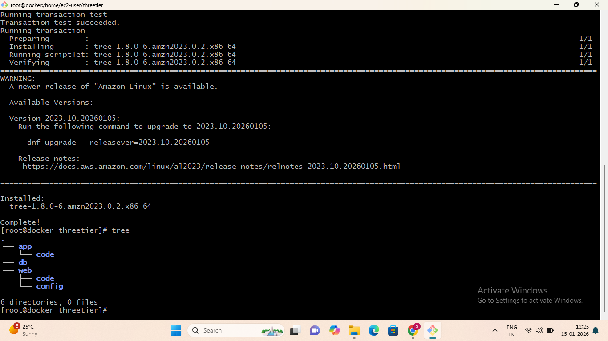
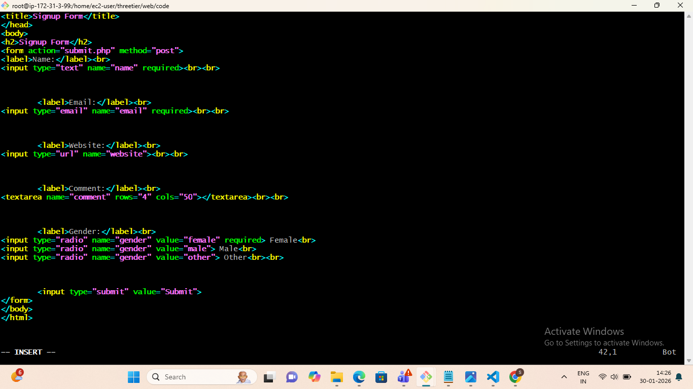
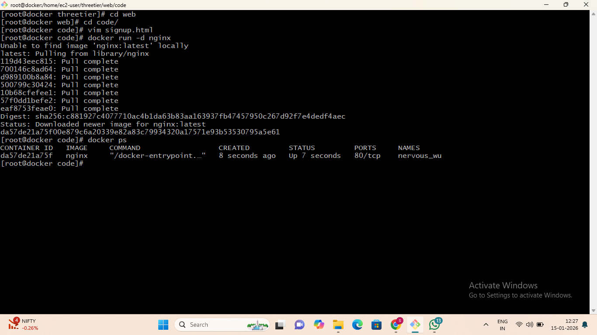
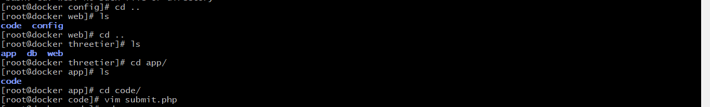
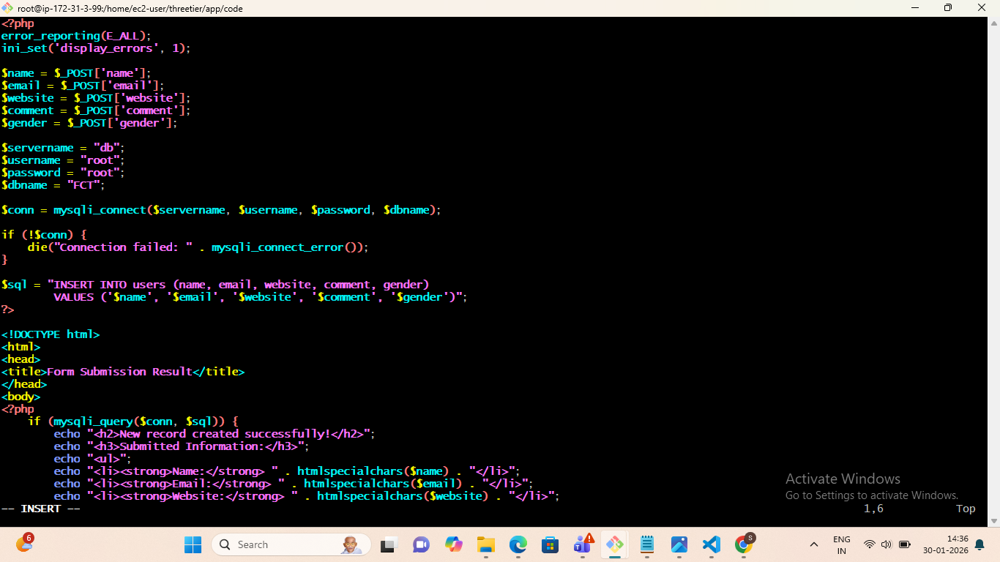
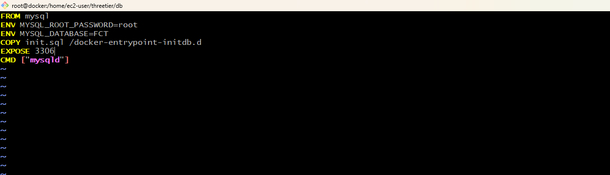
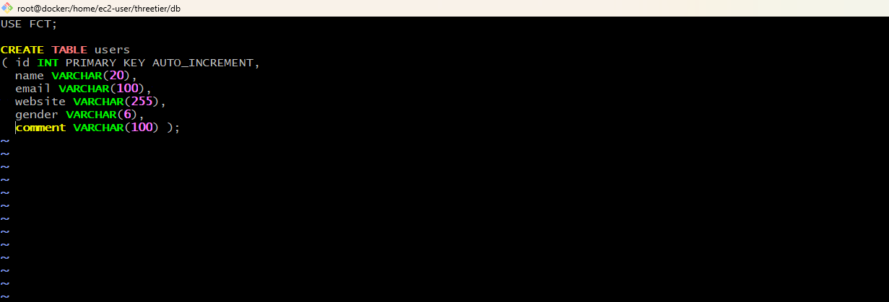
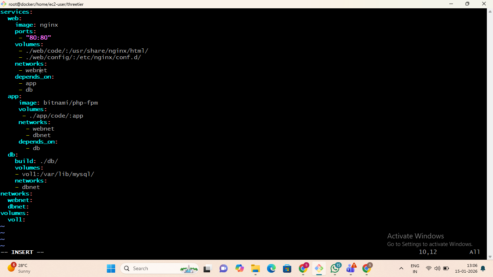
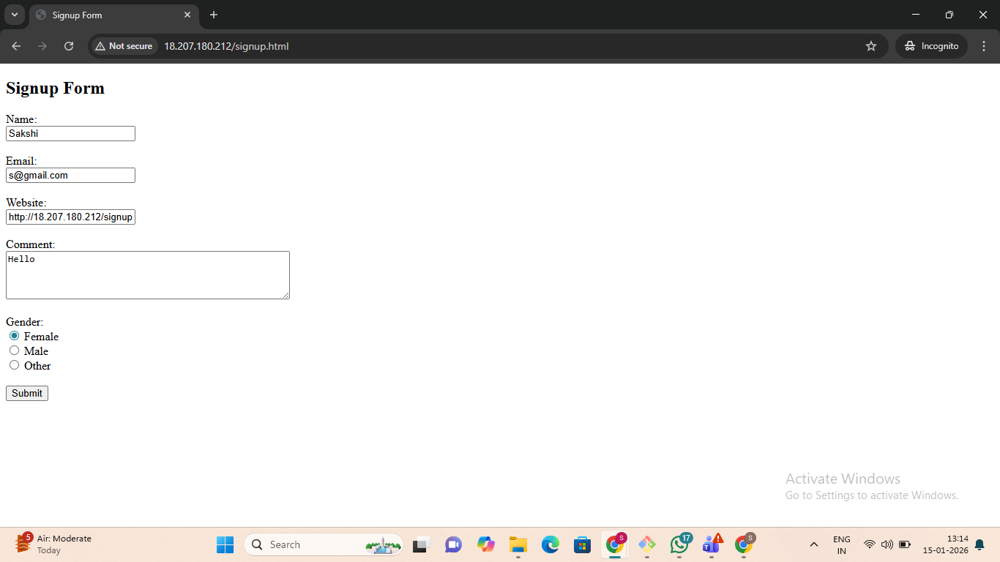
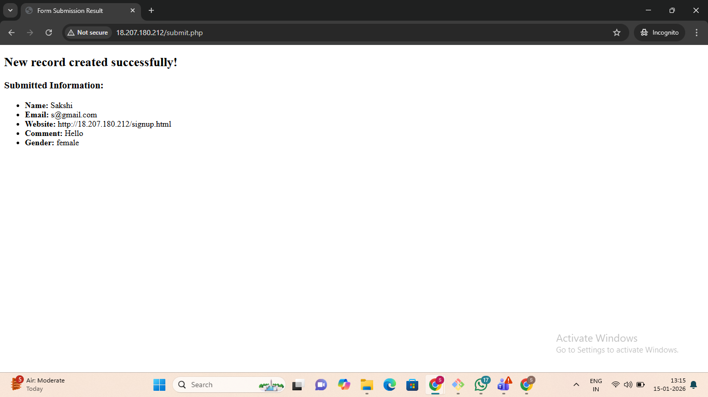

# __Student Registration Form using Three Tier Architecture(docker-based)__

This project implements a Student Registration System using Docker and Three-Tier Architecture. The application is divided into web (nginx), Application (php-fpm), and Database (mysql) tiers, each running in separate containers and connected via Docker network

## Archiecture Overview
The project follows a Three-Tier Architecture:

- __Web Tier (Nginx):__
  Handles HTTP requests and serves frontend pages.

- __Application Tier (PHP-FPM):__
  Processes business logic and handles form submission.

- __Database Tier (MySQL):__
  Stores student registration data.
## Architecture Diagram

 ## Technologies Used
  - Docker
  - Docker Compose
  - Nginx
  - PHP-FPM
  - HTML & PHP
  - Linux
  
 ## 🌐 Docker Networks Configuration

__- webnet:__
  Connects Nginx and PHP-FPM containers

__- dbnet:__
  Connects PHP-FPM and MySQL containers

## Prerequisites
Before starting the deployment, ensure the following are installed on the server:
- Docker
- Docker Compose
  
Verify:

    docker --version
    docker-compose --version
## Project Dirctory Structure

## Deployment Steps:
### Step 1: 
- Switch to root user and go to ec2-user
  
      sudo -i
      cd /home/ec2-user

- Create Project Folder name it as threetier 

       mkdir threetier
       cd threetier
- inside prject directory create Three-tier directories 
  
        mkdir web app db

- Create web tier strucutre 
    
       cd web
       mkdir code config
       cd..
- Create application tier structure
 
       cd app
       mkdir code 

 ### - Verify project structure

 

 ### Step 2: Create Signup Form(web tier)

        cd web
        cd code
        vim signup.html

- Add html signup form, then save and exit.
  

- Run Nginx Container (Temporary)
 
       docker run -d nginx
       docker ps 

### Step 3: Copy Default Nginx Configuration

Enter nginx container:

    dockr exec -it <container id> /bin /bash
inside container:

    cd /etc/nginx/conf.d
    cat deafault.conf

copy the server block, then:
   
      exit

### Step 4: Create custom Nginx config

         cd web
         cd config
         vim defaut.conf

Changes done:

- Paste server block
- Uncomment location ~ \.php$
- Add root folder /app
- Set fastcgi_pass app:9000 (in app container listen port 9000)
 
 Save and exit.
  
 

### Step 5: Create PHP file (Application tier)

    cd ../../app
    cd code
    vim submit.php

Here submit.php file

### Step 6: Create Database Dockerfile

      cd ../../db
      vim Dockerfile
Add Mysql image configuartion, then save and exit

- Create database initialization file
  
      vim init.sql

Add table creation SQL, then save and exit.

### Step 7: Create Docker compose file

      cd ..
      vim docker-compose.yml

Docker Compose Includes:
- Web container (Nginx)
- App container (PHP-FPM)
- DB container (MySQL)
- Web & DB networks
- Volumes for persistence
  
Save and exit.

### Step 8: Start the Application

      docker compose up -d

* Access the Application
  
Open browser:

    

  

  Conclusion:

  In this project, a Docker-based three-tier architecture was successfully implemented using Nginx (Web Tier), PHP-FPM (Application Tier), and MySQL (Database Tier). Each component was containerized and isolated using Docker networks, ensuring clear separation of concerns and secure communication between services. All configurations are defined within a single docker-compose.yml file, which minimizes manual setup and simplifies deployment. As a result, the entire application can be started using docker compose up -d and stopped using docker compose down, making the solution efficient, consistent, and easy to deploy.